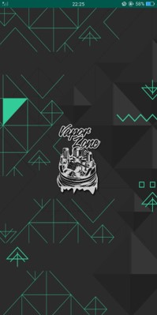
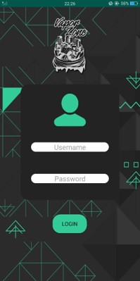
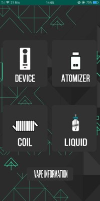
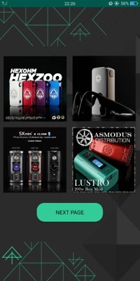
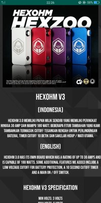

# VaporZone
Berikut adalah user manual dari penggunaan aplikasi VaporZone
 
1. Tampilan awal untuk splash screen, tunggu selama 4 detik 

2. Membuka menu login page, isi bebas karena masih percobaan, kemudian tekan login 

3. Setelah login, akan tampak nama username di atas, kemudian pilih 5 menu yang ingin dipilih. Misalkan memilih Device, maka tekan Device 

4. Kemudian terdapat beberapa pilihan device yang ingin dicari, tekan next page untuk melihat halaman selanjutnya. Tetapi karena masih terdapat 4 konten maka akan mentoast Coming Soon 

5. Setelah menekan salah satu device yang tersedia, maka anda akan diarahkan menuju informasi device 

6. Karena informasi panjang, maka geser atas bawah untuk melihat informasi detail
